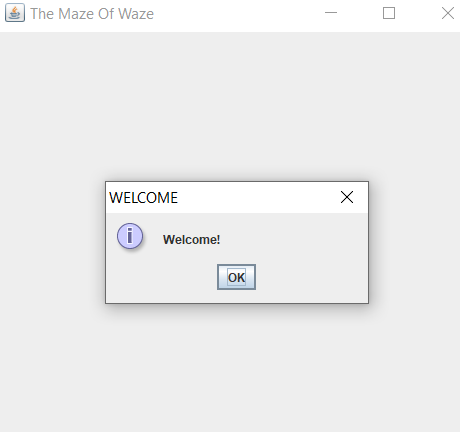

# Ex3+Ex4 The Maze Of Waze

In this project we represnt an implementation of the game "The Maze Of Waze".
This assignment data structures and algorithms are based on previous project Ex2:
[https://github.com/LeeKochav/java_ex2](https://github.com/LeeKochav/java_ex2)

The main goal of the project is to:
- Develop a logic for a game in which a group of robots must perform movement tasks (fruit collection) on a weighted graph.
- Create KML files that exemplify the game in google earth.
- Collect as many fruits as possible and perform minimum robots moves during limited time of the game.


## How to play  

1. Launch the game



2. Insert a stage (0-23 options)


3. Select mode 
- There are two modes to play to game:
	- Manual
		- In manual mode in order to move the robots, click on the screen a message with the robot number appears and insert the destination node for that robot.
		- Note: only neighbors nodes are valid for robot movement, meaning that the source node and the destination node share an edge, .
	- Automate 
		- In Automate mode the robots are moving according an algorithm we developed.
		


**NOW THE GAME BEGINS**

- In the end of the game the score will appear on the screen.

## Fruit class

This class represents the set of operations applicable on a fruit.

**Example:**
```java
String s="{\"Fruit\":{\"value\":" + value + "," + "\"type\":" + type + "," + "\"pos\":\"" + pos.toString()+ "\"" + "}" + "}";
Fruit fruit=new Fruit(s);
```

## Robot class

This class represents the set of operations applicable on a robot.

**Example:**
```java
String s="{\"Robot\":{\"id\":"+id+",\"value\":"+value+",\"src\":"+src+",\"dest\":"+dest+",\"speed\":"+speed+",\"pos\":\""+pos+"\"}}";
Robot robot=new Robot(s);
```

## Game class

This class represents a game scenario of the "MAZE OF WAZE game" depends of a stage, [0-24], that is given.
This class uses a given an imported jar file -Game_Server that implemented a set of operations applicable on a game.

**Example:**
```java
int stage=3; 
Game game=new Game(stage) //stage options (0-23)
```

## MyGameGUI class

This class represents a Graphical User Interface - GUI of the game.

**Example:**
```java
int stage=3; 
int mode;
Game game=new Game(stage) //stage options (0-23)
MyGameGUI game_gui=new MyGameGUI(game,mode); //mode 0|1 (manual | automate)
```

## Main_Thread class

This class represents the engine of the the "MAZE OF WAZE" game.

**Example:**
```java
Main_Thread client=new Main_Thread();
client.start();
```

## Algo_Game class

This class represent the game when the mode is automate.

**Example:**
```java
int stage=3; 
Game game=new Game(stage) //stage options (0-23)
Algo_Game algo_game=new Algo_Game(game);
```

## KML_Logger class

This class represent a KML_Logger object that creates a KML file for each game.

**Example:**
```java
int stage=3; 
KML_Logger km=new KML_Logger(stage);
```

## External libraries
1. junit-jupiter-api-5.4.0
2. junit-platform-commons-1.4.0


More details can be found on Wiki.

	
	